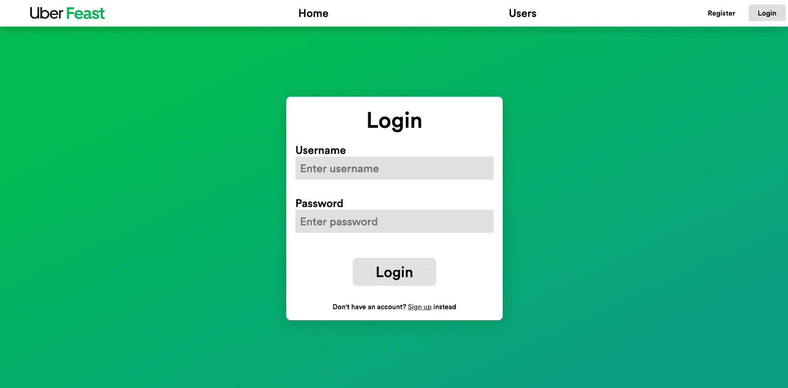

# Uber Feast

### Main features:

- Features a responsive UI
- Almost all actions are transitioned with a smooth animation
- Uses a MongoDB to store user data
- Dynamically loads restaurant information from the backend

 

**A georgeous UI featuring smooth animations** 

**A beautiful Uber Eats reskin** 

**A login system to keep track of your order** 
